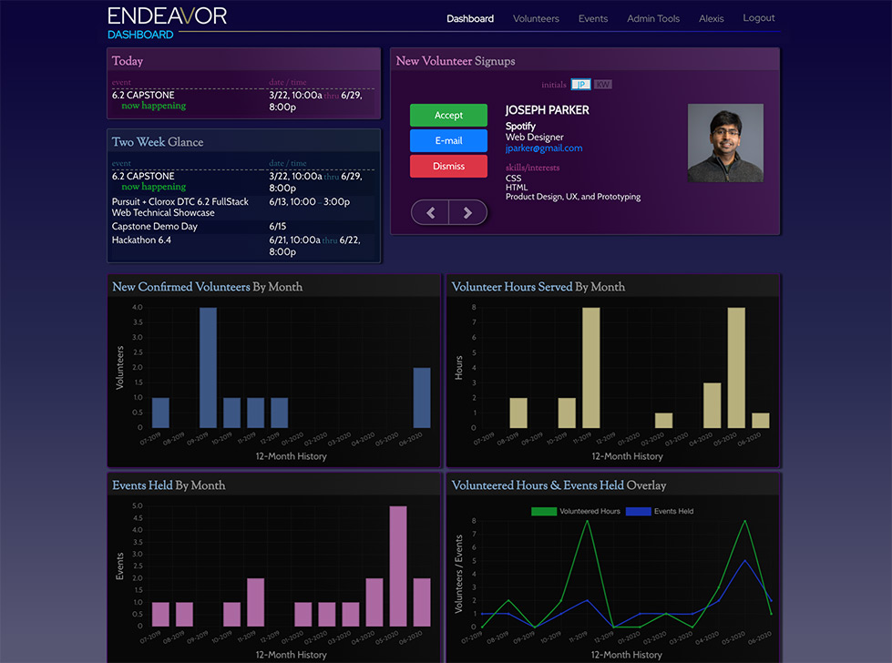

# Endeavor

*A volunteer management full-stack app developed to backbone an organization’s engagement with and availment of its industry volunteers community force.*

## **Developers**
+ [Anime Bensalem (@AminesCodes)](https://github.com/AminesCodes) [[LI]](https://www.linkedin.com/in/amine-bensalem/)
+ [Briahana Maugé (@Briahana-Mauge)](https://github.com/Briahana-Mauge) [[LI]](https://www.linkedin.com/in/bmauge/)
+ [Joseph P. Pasaoa (@joseph-p-pasaoa)](https://github.com/joseph-p-pasaoa) [[LI]](https://www.linkedin.com/in/josephpasaoa/)

## **Demos**
+ **Live:** [Demo](https://endeavor-app.herokuapp.com/)
- **Presentation Video (Youtube):**

  [](https://youtu.be/oaP1JNZTj6Q)

- **Admin Dashboard screencap:**

  
- **New Volunteers Module videocap:**

  

## **Instructional Team**
+ **Lead Instructor:** [Alejandro Franco (@alejo4373)](https://github.com/alejo4373)
+ **Instructor Asst:** [Jung Rae Jang (@jungraejang)](https://github.com/jungraejang)
+ **Instructor Asst:** [Wynter Reid (@wynterreid)](https://github.com/wynterreid)
+ **Program Manager:** [Dessa Shepherd](https://www.linkedin.com/in/dessa-shepherd-7a55b374/)
+ **Advisor:** [Dion Ridley (@dionridley)](https://www.linkedin.com/in/dionridley/)
+ **Advisor:** [Ben Sussman (@bensussman)](https://www.linkedin.com/in/bensussman/)

---

## **_Table of Contents_**
+ I. [Technologies Implemented](#i-technologies-implemented)
+ II. [Setup](#ii-setup)
+ III. [Database Schema](#iii-database-schema)
+ IV. [Server Endpoints](#iv-server-endpoints)
+ V. [Future Implementations](#v-future-implementations)


---


## I. Technologies Implemented
- SendGrid API v3
- Google Calendar

+ PostgreSQL 12.1
+ React 16.13.1
+ Node.js 12.5.0
+ Express.js 4.16.1
+ AWS-SDK 2.647.0
+ Multer 1.4.2
+ Multer-S3 2.9.0
+ Passport 0.3.1
+ Passport-Local 1.0.0
+ BCrypt 4.0.1
+ SendGrid/Mail 7.0.1
+ Chart.js 2.9.3
+ Moment 2.24.0
+ Query-String 6.12.1
+ Node-Sass (SCSS) 4.14.1
+ React Epic Spinners 0.4.1
+ React Icons 3.10.0
+ Pg-promise 10.4.4
+ Axios 0.19.2
+ JavaScript ES5+
+ CSS3
+ HTML5


## II. Setup
+ To run this project, using PostgreSQL and npm, install the seeded database and server:
  ```
  $ cd backend
  $ npm run quick_install
  ```
+ Then in a second terminal instance install the frontend locally using npm:
  ```
  $ cd ../frontend
  $ npm run quick_install
  ```
+ The app site will be found at: http://localhost:3008/


---


### **Developers' Notes**


## III. Database Schema


## IV. Server Endpoints
- **Auth**
  | Method | Endpoint                 | Description                  | Query Parameters | Body Data |
  | ------ | ------------------------ | ---------------------------- | ---------------- | --------- |
  | GET    | `/api/auth/is_logged`    | Check if a user is logged in | n/a              | n/a       |
  | POST   | `/api/auth/login`        | Login a user                 | n/a              | email, password       |
  | POST   | `/api/auth/:role/signup` | Sign up new user             | n/a              | *Please refer to user's data below, minus picture* |
  | PUT    | `/api/auth/:id`          | Update user information      | n/a              | *Please refer to user's data below* |

  - **Admin User Body Data:**
email, password, newPassword, firstName, lastName, picture

  - **Fellow User Body Data:**
email, password, newPassword, firstName, lastName, cohortId, picture

  - **Volunteer User Body Data:**
email, password, firstName, lastName, company, title, skills (array), slug, mentor, officeHours, techMockInterview, behavioralMockInterview, professionalSkillsCoach, hostSiteVisit, industrySpeaker, publicProfile, picture


- **Users**
  | Method | Endpoint               | Description                    | Query Parameters | Body Data |
  | ------ | ---------------------- | ------------------------------ | ---------------- | --------- |
  | POST   | `/api/users/:role/add` | Create new pre-registered user | n/a              | email, password, role |
  | PATCH  | `/api/users/:id`       | Update user's password         | n/a              | password, newPassword, confirmPassword |
  | DELETE | `/api/users/:id`       | Delete user                    | n/a              | n/a                                    |


- **Volunteers**
  | Method | Endpoint                      | Description                           | Query Parameters                     | Body Data |
  | ------ | ----------------------------- | ------------------------------------- | ------------------------------------ | --------- |
  | GET    | `/api/volunteers/:type/:id`   | Get volunteer by id, slug or email    | type: id, slug, email                | n/a       |
  | GET    | `/api/volunteers/skills/:id`  | Get volunteer skills user id          | type: id, slug, email                | n/a       |
  | GET    | `/api/volunteers/all`         | Get all volunteer (with filters)      | v_email, name, skill, company, title | n/a       |
  | GET    | `/api/volunteers/new`         | Get all unconfirmed volunteers        | n/a                                  | n/a       |
  | PATCH  | `/api/volunteers/confirm/:id` | Confirm a new (unconfirmed) volunteer | n/a                                  | n/a       |


- **Fellows**
  | Method | Endpoint              | Description                    | Query Parameters     | Body Data |
  | ------ | --------------------- | ------------------------------ | -------------------- | --------- |
  | GET    | `/api/fellows/`       | Get all fellows (with filters) | name, cohort, mentor | n/a       |
  | GET    | `/api/fellows/id/:id` | Get single fellow by id        | n/a                  | n/a       |


- **Skills**
  | Method | Endpoint               | Description                | Query Parameters  | Body Data |
  | ------ | ---------------------- | -------------------------- | ----------------- | --------- |
  | GET    | `/api/skills/`         | Get all skills             | n/a               | n/a       |
  | POST   | `/api/skills/add/`     | Add single skill           | n/a               | skill     |
  | PUT    | `/api/skills/edit/:id` | Rename single skill by id  | n/a               | skill     |
  | DELETE | `/api/skills/del/:id`  | Delete single skill by id  | n/a               | n/a       |


- **Cohorts**
  | Method | Endpoint                | Description                 | Query Parameters | Body Data |
  | ------ | ----------------------- | --------------------------- | ---------------- | --------- |
  | GET    | `/api/cohorts/`         | Get all cohorts             | n/a              | n/a       |
  | POST   | `/api/cohorts/add/`     | Add single cohort           | n/a              | cohort    |
  | PUT    | `/api/cohorts/edit/:id` | Rename single cohort by id  | n/a              | cohort    |
  | DELETE | `/api/cohorts/del/:id`  | Delete single cohort by id  | n/a              | n/a       |


- **Events**
  | Method | Endpoint                      | Description                   | Query Parameters | Body Data |
  | ------ | ----------------------------- | ----------------------------- | ---------------- | --------- |
  | GET    | `/api/events/all`             | Get all events (with filters) | v_name, topic, instructor, upcoming, past | n/a |
  | GET    | `/api/events/event/:id`       | Get event by id               | n/a              | n/a                         |
  | GET    | `/api/events/dashboard/:role` | Get dashboard events          | n/a              | n/a                         |
  | POST   | `/api/events/add`             | Add a new event               | n/a              | *Please refer to events data below* |
  | PUT    | `/api/events/edit/:id`        | Update an event by id         | n/a              | *Please refer to events data below* |
  | DELETE | `/api/events/:id`             | Delete event by id            | n/a              | n/a                         |
  - **Events Body Data**
start, end, topic, description, staffDescription, attendees, location, instructor, numberOfVolunteers, materialsUrl, important


- **Mentor Pairs**
  | Method | Endpoint            | Description                  | Query Parameters | Body Data             |
  | ------ | ------------------- | ---------------------------- | ---------------- | --------------------- |
  | POST   | `/api/mentor_pairs` | Pair a Mentor with a Mentee  | n/a              | volunteerId, fellowId |
  | DELETE | `/api/mentor_pairs/volunteer/:v_id/fellow/:f_id` | Un-pair a Mentor to a Mentee | n/a | volunteerId, fellowId |


- **Event Attendees**
  | Method | Endpoint                                                       | Description                           | Query Parameters | Body Data            |
  | ------ | -------------------------------------------------------------- | ------------------------------------- | ---------------- | -------------------- |
  | POST   | `/api/event_attendees/event/:e_id/add/:v_id`       | Volunteer request to an event         | n/a              | n/a                  |
  | PUT    | `/api/event_attendees/event/:e_id/volunteer/:v_id` | Attribute hours to volunteer          | n/a              | volunteeredHours     |
  | PATCH  | `/api/event_attendees/event/:e_id/volunteer/:v_id` | Confirm/un-confirm volunteer to event | n/a              | confirmed true/false |
  | DELETE | `/api/event_attendees/event/:e_id/delete/:v_id`   | Delete volunteer request to an event  | n/a              | n/a                  |


- **View**
  | Method | Endpoint    | Description                                                 | Query Parameters | Body Data  |
  | ------ | ----------- | ----------------------------------------------------------- | ---------------- | ---------- |
  | PATCH  | `/api/view` | Manage the view type for events and volunteers (grid/list)  | n/a              | targetView |


## V. Future Implementations
+ Google Calendar Embedment
+ Event Templating
+ Bulk Email Selecting
+ Advanced Search Sorting
+ Fellow Users Build
+ Non-Admin Staff Build
+ Admininstrative Externalities Settings (SendGrid ID, Google Calendar Account Target, etc.)
+ Theming & Branding Customization
